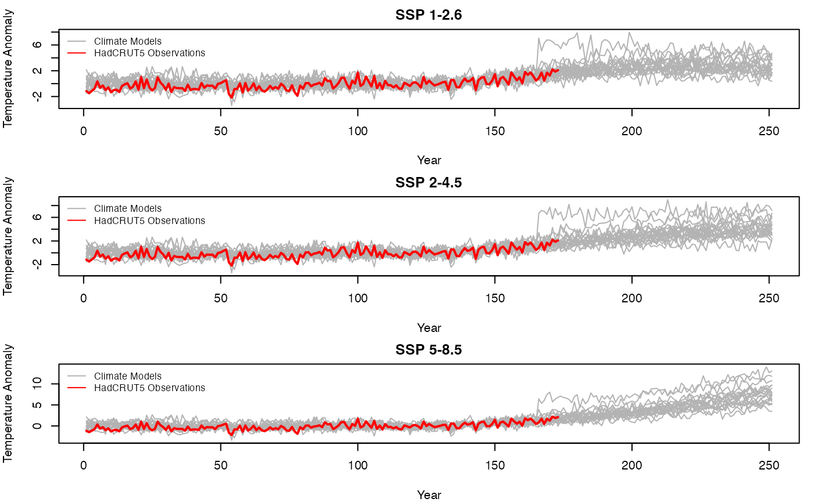
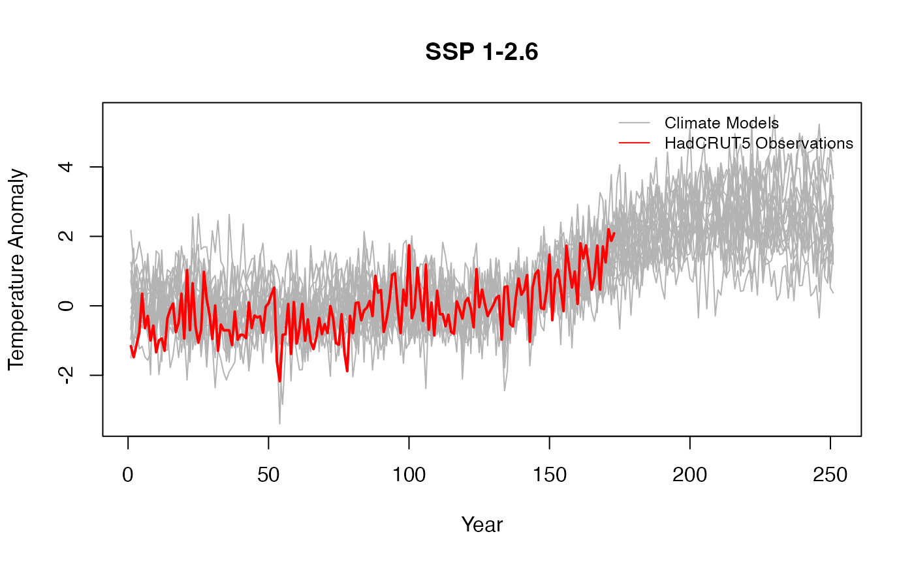
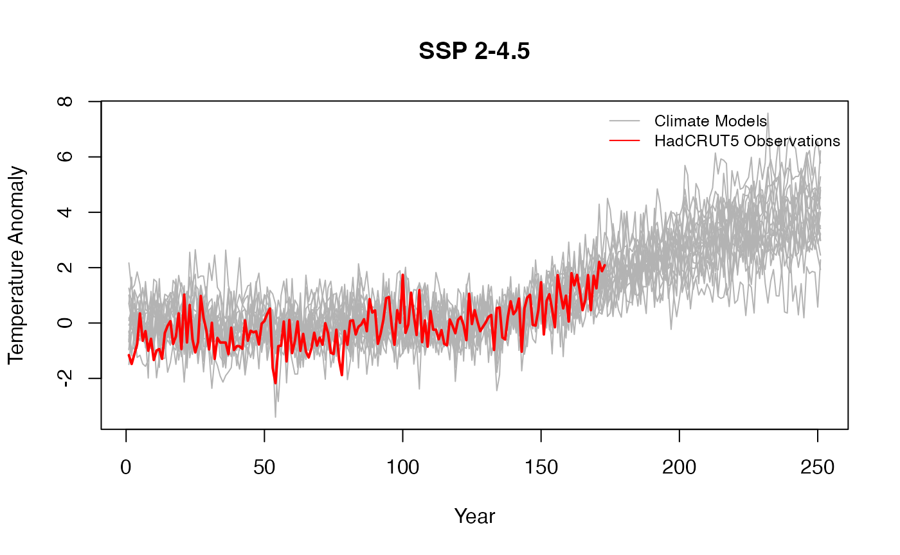
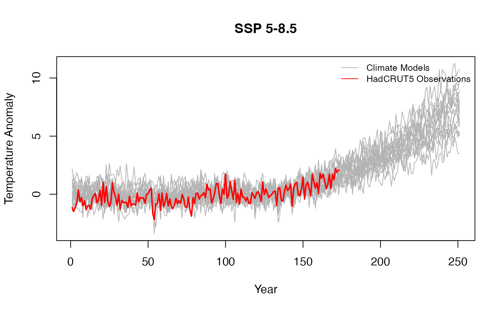
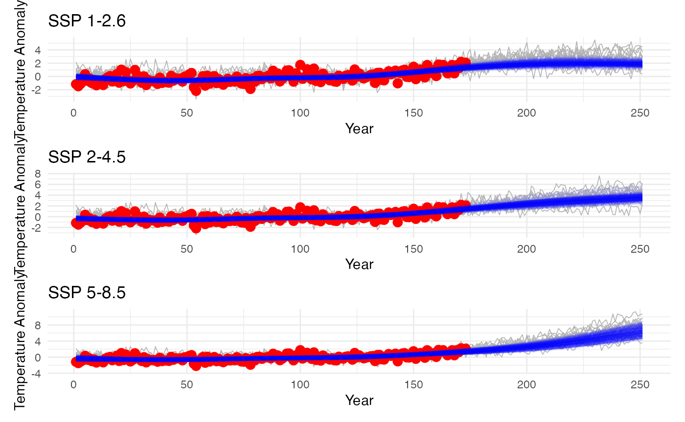

# Fitting BFACT to Real Climate Data

## Fitting BFACT to Real Climate Data

This vignette demonstrates the complete workflow for fitting the BFACT
model to real climate data, using New York temperature anomalies as an
example.

### Introduction

The BFACT package includes real climate data from: - **Climate Models**:
Temperature anomalies from CMIP6 models for 3 SSP scenarios
(1850-2100) - **Observations**: HadCRUT5 annual temperature anomalies
(1850-2022) - **Location**: New York region, summer (JJA) seasonal
averages

This vignette demonstrates model fitting on a smaller scale.

### Load Real Climate Data

``` r

library(BFACT)
library(ncdf4)
library(patchwork)

# Load NetCDF file containing New York temperature anomalies
nc_file <- system.file("data", "NewYork_temperature_anomalies_JJA_all_models_1961-1990baseline.nc", package = "BFACT")
nc_data <- nc_open(nc_file)

# Extract temperature data: dimensions are [lon, lat, year, scenario, model]
temp_data <- ncvar_get(nc_data, "temperature")
years <- ncvar_get(nc_data, "year")
models <- ncvar_get(nc_data, "model")
# Spatially average across lon and lat for each year, scenario, and model
# Result: [year, scenario, model] = [251, 3, 19]
temp_avg <- apply(temp_data, c(3, 4, 5), mean, na.rm = TRUE)

# Extract data for each SSP scenario
# Scenarios: 1=SSP1-2.6, 2=SSP2-4.5, 3=SSP5-8.5
climate_models <- list(
    z126c = temp_avg[, 1, ],
    z245c = temp_avg[, 2, ],
    z585c = temp_avg[, 3, ]
)

# Add model names as column names
for (i in seq_along(climate_models)) {
    colnames(climate_models[[i]]) <- models
}

# Observations are available for years 1-173 (1850-2022)
hadcrut_file <- system.file("data", "hadcrut5_annual.rds", package = "BFACT")
hadcrut5_annual <- readRDS(hadcrut_file)

nc_close(nc_data)

# Data summary
cat("Climate model dimensions:", dim(climate_models$z126c), "\n")
```

    ## Climate model dimensions: 251 19

``` r

cat("HadCRUT5 observations:", length(hadcrut5_annual), "years\n")
```

    ## HadCRUT5 observations: 173 years

### Visualize Data

Plot the climate models and observations to see what we’re working with:

``` r

par(mfrow = c(3, 1), mar = c(4, 4, 2, 1))
scenarios <- c("z126c", "z245c", "z585c")
titles <- c("SSP 1-2.6", "SSP 2-4.5", "SSP 5-8.5")

for (i in seq_along(scenarios)) {
    mat <- climate_models[[scenarios[i]]]
    matplot(1:nrow(mat), mat,
        type = "l", lty = 1, col = "gray70",
        xlab = "Year", ylab = "Temperature Anomaly", main = titles[i],
        ylim = range(c(mat, hadcrut5_annual), na.rm = TRUE)
    )
    # Add HadCRUT5 observations as red line for overlapping years
    n_hadcrut <- length(hadcrut5_annual)
    lines(1:n_hadcrut, hadcrut5_annual, col = "red", lwd = 2)
    legend("topright",
        legend = c("Climate Models", "HadCRUT5 Observations"),
        col = c("gray70", "red"), lty = c(1, 1), cex = 0.8, bty = "n"
    )
}
```



### Prune Data for Model Fitting

There are two climate models that are clear outliers in all scenarios.
We apply an outlier detection method to identify and remove these models
before fitting the BFACT model. This step is performed indpendently for
each scenario.

``` r

# Apply outlier detection to each scenario and prune
pruned_climate_models <- list()
outlier_models <- list()

for (i in seq_along(scenarios)) {
    mat <- climate_models[[scenarios[i]]]
    outlier_models[[scenarios[i]]] <- BFACT::detect_outliers(
        data = mat,
        start_index = 1,
        end_index = nrow(mat),
        threshold_fn = BFACT::mean_sd_threshold,
        threshold_dial = 2.5
    )
    pruned_climate_models[[scenarios[i]]] <- mat[, !colnames(mat) %in% outlier_models[[scenarios[i]]], drop = FALSE]
}

cat("Outliers by scenario:\n")
```

    ## Outliers by scenario:

``` r

print(outlier_models)
```

    ## $z126c
    ## [1] "CIESM"       "UKESM1-0-LL"
    ## 
    ## $z245c
    ## [1] "CIESM"       "UKESM1-0-LL"
    ## 
    ## $z585c
    ## [1] "CIESM"       "UKESM1-0-LL"

``` r

# Use pruned data for downstream fitting
climate_models <- pruned_climate_models

for (i in seq_along(scenarios)) {
    mat <- climate_models[[scenarios[i]]]
    matplot(1:nrow(mat), mat,
        type = "l", lty = 1, col = "gray70",
        xlab = "Year", ylab = "Temperature Anomaly", main = titles[i],
        ylim = range(c(mat, hadcrut5_annual), na.rm = TRUE)
    )
    # Add HadCRUT5 observations as red line for overlapping years
    n_hadcrut <- length(hadcrut5_annual)
    lines(1:n_hadcrut, hadcrut5_annual, col = "red", lwd = 2)
    legend("topright",
        legend = c("Climate Models", "HadCRUT5 Observations"),
        col = c("gray70", "red"), lty = c(1, 1), cex = 0.8, bty = "n"
    )
}
```



### Fit BFACT Models

Fit the BFACT model for each SSP scenario. This demonstration uses 100
MCMC iterations for speed; the full analysis in the paper uses 10000
iterations. Here we fit just H=2 for simplicity.

``` r

# Fit BFACT for each SSP scenario
# Note: Using reduced parameters for demonstration
# Paper uses: H=2:7, nsim=10000
results <- list()

for (i in seq_along(scenarios)) {
    cat(sprintf("\n=== Fitting %s ===\n", titles[i]))

    fit <- BFACT(
        Y = climate_models[[scenarios[i]]],
        z = hadcrut5_annual,
        T = 251, # Total time points
        T1 = 1, # Start of climate model data
        T2 = 173, # End of observation data
        H = 2, # Basis dimension (paper fits 2:7)
        iseed = 123 + i, # Different seed for each scenario
        J = 6, # Burnin iterations
        nsim = 100 # MCMC iterations (paper uses 10000)
    )
    results[[scenarios[i]]] <- fit

    cat(sprintf("Completed fit for %s\n", titles[i]))
}
```

    ## 
    ## === Fitting SSP 1-2.6 ===
    ## Completed fit for SSP 1-2.6
    ## 
    ## === Fitting SSP 2-4.5 ===
    ## Completed fit for SSP 2-4.5
    ## 
    ## === Fitting SSP 5-8.5 ===
    ## Completed fit for SSP 5-8.5

- `nsim`: Number of MCMC iterations (100 here for speed, 10000 in the
  paper)
- `J`: Burnin iterations
- `H`: Basis functions (2-7 in full analysis)
- Each fit at H=2 with 100 iterations takes ~1-2 seconds

### Visualize Posterior Results

Plot the posterior samples against the observations and models:

``` r

# Generate plots for each scenario
plots <- list()

for (i in seq_along(scenarios)) {
    # Get posterior samples
    fit <- results[[scenarios[i]]]
    burn_start <- ceiling(nrow(fit$beta_samples) / 2)

    # Compute posterior means for each sample
    post_samples <- sample_posterior(fit)

    # Create plot using the new function
    plots[[i]] <- plot_data_with_posterior(
        Y = climate_models[[scenarios[i]]],
        z = hadcrut5_annual,
        posterior_samples = post_samples,
        title = titles[i],
        years = 1:251,
        obs_years = 1:173
    )
}

# Combine plots with patchwork
combined_plot <- plots[[1]] / plots[[2]] / plots[[3]]
print(combined_plot)
```


