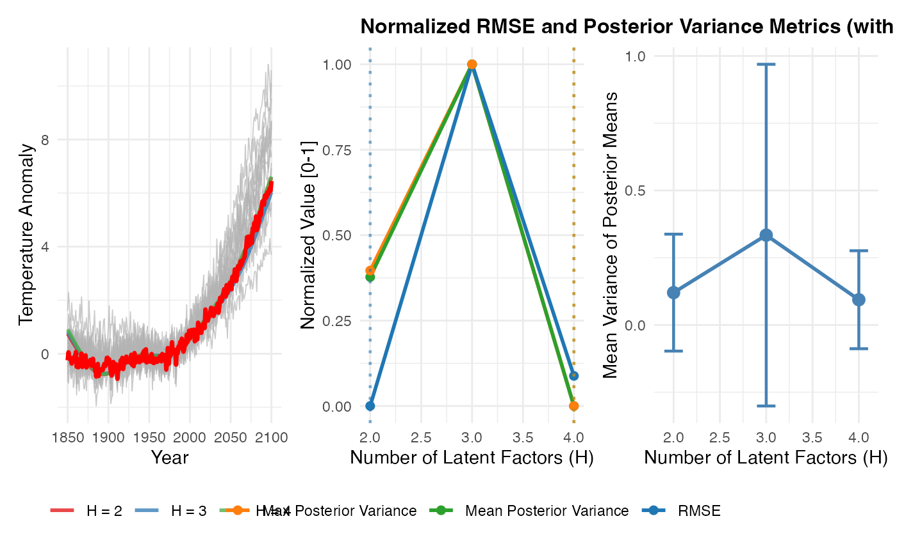

# Model Selection Across Multiple Replications

## Model Selection Across Multiple Replications

This vignette demonstrates how to assess model selection performance
(finding the true H) across multiple independent replications of the
data.

We will:

1.  Generate synthetic data with known true $`H_0`$ value
2.  Create 3 independent replications
3.  Fit BFACT with $`H \in 2, \ldots, 4`$ to each replicate
4.  Aggregate results across replications using
    [`consolidate_results()`](https://shalenik.github.io/BM3/reference/consolidate_results.md)
5.  Show summary statistics on model selection

``` r

library(BFACT)
library(ggplot2)
library(dplyr)
```

    ## 
    ## Attaching package: 'dplyr'

    ## The following objects are masked from 'package:stats':
    ## 
    ##     filter, lag

    ## The following objects are masked from 'package:base':
    ## 
    ##     intersect, setdiff, setequal, union

``` r

library(ncdf4)
library(patchwork)
```

### Steps 1 & 2: Generate Multiple Replications

We’ll generate 3 replications of synthetic data from a true $`H_0=2`$
model, using different random seeds:

``` r

# Generate synthetic data from real posterior
nc_file <- system.file("data", "NewYork_temperature_anomalies_JJA_all_models_1961-1990baseline.nc", package = "BFACT")
nc <- nc_open(nc_file)
temp_data <- ncvar_get(nc, "temperature")
years <- ncvar_get(nc, "year")
models <- ncvar_get(nc, "model")
temp_avg <- apply(temp_data, c(3, 4, 5), mean, na.rm = TRUE)
Y_real <- temp_avg[, 3, ]
colnames(Y_real) <- models 
# Remove outlier models
outliers <- BFACT::detect_outliers(
    data = Y_real,
    start_index = 1,
    end_index = nrow(Y_real),
    threshold_fn = BFACT::mean_sd_threshold,
    threshold_dial = 2.5
)
if (length(outliers) > 0) {
    cat("Removed outlier models:", paste(outliers, collapse = ", "), "\n")
    Y_real <- Y_real[, !colnames(Y_real) %in% outliers, drop = FALSE]
}
```

    ## Removed outlier models: CIESM, UKESM1-0-LL

``` r

climate_models <- list(z585c = Y_real)
hadcrut_file <- system.file("data", "hadcrut5_annual.rds", package = "BFACT")
hadcrut5_annual <- readRDS(hadcrut_file)
nc_close(nc)

# Fit to real data to get a posterior draw
cat("Fitting BFACT to real data to generate posterior...\n")
```

    ## Fitting BFACT to real data to generate posterior...

``` r

fit_real <- BFACT(
    Y = climate_models$z585c,
    z = hadcrut5_annual,
    T = nrow(climate_models$z585c),
    T1 = 1,
    T2 = length(hadcrut5_annual),
    H = 2,
    iseed = 999,
    J = 6,
    nsim = 100
)

# Generate 3 replications from the posterior
n_reps <- 3
sims_list <- list()
for (rep in 1:n_reps) {
    cat(sprintf("Generating replicate %d/%d...\n", rep, n_reps))
    sim_rep <- simulate_from_posterior(
        fit_real,
        s = NULL, # Random sample from second half of chain
        seed = 1000 + rep
    )
    sims_list[[rep]] <- sim_rep
}
```

    ## Generating replicate 1/3...
    ## Generating replicate 2/3...
    ## Generating replicate 3/3...

``` r

cat(sprintf("Generated %d replications with H_true = 2\n", n_reps))
```

    ## Generated 3 replications with H_true = 2

### Step 3: Fit BFACT with Multiple H Values to Each Replicate

Now fit H=2, H=3, and H=4 to each replicate:

``` r

H_values <- 2:4
fits_list <- list()

for (rep in 1:n_reps) {
    cat(sprintf("\n=== Replicate %d/%d ===\n", rep, n_reps))
    sim_rep <- sims_list[[rep]]
    fits_rep <- list()

    for (H in H_values) {
        cat(sprintf("  Fitting H=%d...\n", H))
        fit <- BFACT(
            Y = sim_rep$Y,
            z = sim_rep$z,
            T = sim_rep$T,
            T1 = sim_rep$T1,
            T2 = sim_rep$T2,
            H = H,
            iseed = 2000 + rep * 100 + H,
            J = 6,
            nsim = 50
        )
        fits_rep[[as.character(H)]] <- fit
    }
    fits_list[[rep]] <- fits_rep
}
```

    ## 
    ## === Replicate 1/3 ===
    ##   Fitting H=2...
    ##   Fitting H=3...
    ##   Fitting H=4...
    ## 
    ## === Replicate 2/3 ===
    ##   Fitting H=2...
    ##   Fitting H=3...
    ##   Fitting H=4...
    ## 
    ## === Replicate 3/3 ===
    ##   Fitting H=2...
    ##   Fitting H=3...
    ##   Fitting H=4...

``` r

cat("\nCompleted all fits!\n")
```

    ## 
    ## Completed all fits!

### Step 4: Consolidate Results Across Replications

Use
[`consolidate_results()`](https://shalenik.github.io/BM3/reference/consolidate_results.md)
to aggregate across replications:

``` r

results_multi <- consolidate_results(
    fits = fits_list,
    sim = sims_list,
    by_replicate = TRUE
)
```

    ## Consolidating 3 replicates with multiple H fits...

    ## Consolidating 3 fit(s)...
    ## Consolidating 3 fit(s)...
    ## Consolidating 3 fit(s)...
    ## Consolidating 3 fit(s)...
    ## Consolidating 3 fit(s)...
    ## Consolidating 3 fit(s)...

    ##   Replicate comparison (aggregated across all replicates):

    ## # A tibble: 3 × 8
    ##       H mean_RMSE sd_RMSE min_RMSE max_RMSE n_reps mean_post_var max_post_var
    ##   <int>     <dbl>   <dbl>    <dbl>    <dbl>  <int>         <dbl>        <dbl>
    ## 1     2     0.292  0.0463    0.241    0.331      3        0.0290       0.0683
    ## 2     4     0.308  0.0520    0.262    0.364      3        0.0124       0.0157
    ## 3     3     0.468  0.268     0.289    0.776      3        0.0565       0.148

``` r

# View the replicate comparison table
cat("\n=== Model Selection Summary Across Replications ===\n")
```

    ## 
    ## === Model Selection Summary Across Replications ===

``` r

print(results_multi$replicate_comparison)
```

    ## # A tibble: 3 × 8
    ##       H mean_RMSE sd_RMSE min_RMSE max_RMSE n_reps mean_post_var max_post_var
    ##   <int>     <dbl>   <dbl>    <dbl>    <dbl>  <int>         <dbl>        <dbl>
    ## 1     2     0.292  0.0463    0.241    0.331      3        0.0290       0.0683
    ## 2     4     0.308  0.0520    0.262    0.364      3        0.0124       0.0157
    ## 3     3     0.468  0.268     0.289    0.776      3        0.0565       0.148

### Step 5: Identify the Elbow Point

Use the elbow method to identify the optimal H value where performance
plateaus:

``` r

# Extract H values and mean RMSE
H_vals <- results_multi$replicate_comparison$H
rmse_vals <- results_multi$replicate_comparison$mean_RMSE

# Find the elbow
elbow_H <- find_elbow(H_vals, rmse_vals, minimize = TRUE)

cat(sprintf("\nElbow point identified at H = %d\n", elbow_H))
```

    ## 
    ## Elbow point identified at H = 2

``` r

cat(sprintf(
    "Mean RMSE at H=%d: %.4f\n", elbow_H,
    results_multi$replicate_comparison$mean_RMSE[
        results_multi$replicate_comparison$H == elbow_H
    ]
))
```

    ## Mean RMSE at H=2: 0.2924

### Step 6: Visualize Model Selection Performance with Elbow

Plot RMSE by H across replications with elbow point marked:

``` r

p_avg <- plot_replicate_averages(results_multi, sims_list)
p_norm <- plot_normalized_metrics(
    results_multi$replicate_comparison,
    title = "Normalized RMSE and Posterior Variance Metrics (with Elbow Detection)"
)
p_var <- plot_posterior_variance(results_multi)

combined_plot <- p_avg | p_norm | p_var
print(combined_plot)
```


